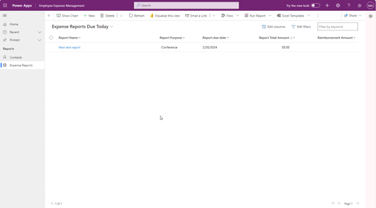

---
lab:
    title: 'Lab 4.4: Build a model-driven app'
---

# Lab 4.4: Build a model-driven app

## Scenario
Bellows College is an educational organization with multiple campuses and programs.

Many of Bellow Colleges instructors and administrators need to attend events, and purchase items. Historically tracking these expenses has been a challenge.
Campus administration would like to modernize their expense reporting system by providing employees with a digital way to report expenses.

Throughout this course, you will build applications and perform automation to enable the Bellows College employees to manage expenses.

## High-level lab steps
As part of configuring the model-driven app, you will complete the following:
- Configure your new model-driven app named Bellows Expense Management

We will work with the following components:
- Views: Views allow the user to display the existing data in the form table.
- Forms: This is where the user creates/updates new rows in the tables.
Both will be integrated to the model-driven app for a better user-experience.

## Prerequisites
- Completion of Module 1 Lab 0 - Validate lab environment

## Exercise 1: Create Model-driven app
**Objective:** In this exercise, you will use the model-driven app that you configured in Lab 4.3. You will then customize the sitemap and test the app.
For simplicity and time’s sake, we will not be addressing all of the Expense Report columns in this lab.

## Task 1: Configure the sitemap
1. If you are not already, sign in to `https://make.powerapps.com`.
2. Select the environment that you imported the Expense Report solution into at the top right if it is not already selected.
3. Using the navigation on the left, select **Solutions.**
4. Open the Expense Report solution.
5. Find the *`Employee Expense Management`* application that you created in the last exercise.
6. Select **Edit** to open the modern app designer.
7. Select **New page** on the command bar.
8. The **New page** screen will open.
9. Choose **Dataverse table.**
10. Select the following tables:
    - Expense Report
    - Expense Line
11. Make sure that Show in navigation is selected.
12. After you have selected both tables, select **Add.**
13. Using the navigation icons on the left side of the screen, select **Navigation.**
14. On the Navigation Pane, select **New Group** below where it says Navigation. You may need to expand the menu on the left.
15. On the right side of the screen, in the Display options section, change the Title property to *`Expense Reports`*.
16. Under the Navigation section, select the **Ellipsis (three dots)** next to **Expense Reports.** From the menu that appears, select **Move Up**. Expense Reports should now appear above Expense Lines in the navigation.
17. Under Navigation, select the **Expense Reports** form.
18. Go to the In this app section on the right side of the screen.
19. Select **Show more.**
20. Select the **Ellipsis** next to Information Quick View Form.
21. From the menu that appears, select **Remove.**
22. Select the **Ellipsis** next to Information Card Form.
23. From the menu that appears, select **Remove.**
24. Under Navigation, select **Expense Lines** form.
25. Go to the In this app section on the right side of the screen.
26. Select **Show more.**
27. Select the **Ellipsis** next to Information Quick View Form.
28. From the menu that appears, select **Remove.**
29. Select the **Ellipsis** next to Information Card Form.
30. From the menu that appears, select **Remove.**
31. Select **Save** and wait until the changes are saved.
32. Once the save is complete, select the **Publish** button to publish your changes. Wait for the publishing to complete.

### Task #2: Test app
**Start the application**
1. Select the Play button, the model-driven app will load in a new tab.

**Create a new Expense Report**
1. Select **Expense Reports** from the left-hand navigation (also known as the sitemap).
2. Select **+ New.**
3. Enter the fields as follows:
    - Report Name: **`New Test Report`**
    - Report Purpose: Select **`Conference`**
    - Report due date: Select **`Today's date`**
4. Select **Save & Close.** This will create the new Test Report and you should be able to see it on the Active Expense Reports view.
5. Change view to **Expense Reports Due Today** by using the drop-down next to Active Expense Reports.
6. You may add some more test records.

Your running model-driven app should look approximately like the following:

Congratulations! You have created and configured your first model-driven app.
